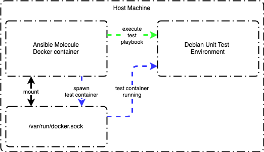

Ansible Role: Denodo Solution Manager
=========

This role installs and configures Denodo Solution Manager.

ToDo's
---------------

1. Update molecule unit test to provide coverage for RHEL based systems.

1. Update role to install Denodo Solution Manager on Debian based systems.

1. Update role to install Denodo Solution Manager on Windows based systems.

1. Upldate molecule unit test to provide coverage for Debian based systems.

1. Update molecule unit test to provide coverage for Windows based systems.

Role Variables
----------------

Ansible variables are listed below and these mainly control the XML config used by the installer. To see defualt values see defaults/main.yml.

```ansible
denodo_mounted_volume_path: 
denodo_solution_manager_derby_port: 
denodo_solution_manager_diagnosticmonitoringtool: 
denodo_solution_manager_install_path:
denodo_solution_manager_license_file:
denodo_solution_manager_licensemanager_port: 
denodo_solution_manager_licensemanagerserver: 
denodo_solution_manager_locale: 
denodo_solution_manager_port: 
denodo_solution_manager_scheduler: 
denodo_solution_manager_scheduleradmin: 
denodo_solution_manager_solutionmanager: 
denodo_solution_manager_solutionmanagerserver: 
denodo_solution_manager_solutionmanagerwebtool: 
denodo_solution_manager_server_asyncrmi_port: 
denodo_solution_manager_server_odbc_port: 
denodo_solution_manager_server_shutdownport: 
denodo_solution_manager_server_port: 
denodo_solution_manager_server_factory_port: 
denodo_solution_manager_setup_type: 
denodo_solution_manager_vdpadmintool: 
denodo_solution_manager_vdpserver: 
denodo_solution_manager_virtualdataport: 
denodo_solution_manager_webdesignstudio: 
denodo_solution_manager_wc_aux_jmx_port: 
denodo_solution_manager_wc_jmx_port: 
denodo_solution_manager_wc_http_port: 
denodo_solution_manager_wc_shutdown_port: 
```

Example Playbook
----------------

Including an example of how to use the role in a playbook:

```ansible
- hosts: all
  become: true
  gather_facts: true
  vars:
    denodo_mounted_volume_path: "{{ lookup('env', 'DENODO_MOUNTED_VOLUME_PATH') | default('/data', true) }}"
  pre_tasks:
    - name: Gather package facts
      package_facts:
        manager: auto
  roles:
    - denodo-solution-manager
```

Testing Role
----------------

The ansible molecule container needs to mount the host machine's /var/run/docker.sock to have the ability to spawn another container representing the environment to unit test the role in. Once the environment container is running, then the molecule container will connect to the test environment container to run the test ansible playbook.



Example docker command to run molecule:

```ansible
docker run --rm -it \
    --env MOLECULE_NO_LOG="false" \
    -v "$(pwd)":/tmp/$(basename "${PWD}"):ro \
    -v /var/run/docker.sock:/var/run/docker.sock \
    -v ~/.ssh:/root/.ssh \
    -w /tmp/$(basename "${PWD}") \
    quay.io/ansible/molecule:3.0.4 \
    molecule test
```

License
-------

[GPLv3](LICENSE)

References
----------

- [Yamllint](https://yamllint.readthedocs.io/en/latest/)
- [Molecule Docker Configuration](https://molecule.readthedocs.io/en/2.22/configuration.html#docker)
- [Linux startup scripts for Solution Manager and License Manager](https://community.denodo.com/kb/view/document/Linux%20startup%20scripts%20for%20Solution%20Manager%20and%20License%20Manager?category=Operation)
